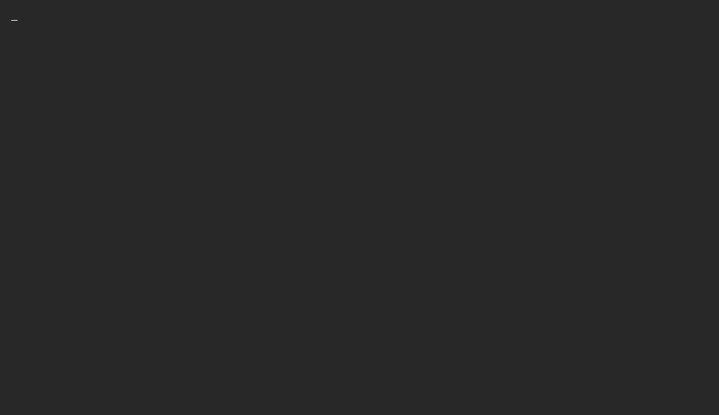

  

  Boot sequence generated with <a href="https://github.com/x0rzavi/github-readme-terminal">github-readme-terminal</a>.

  
  
  

## `whoami`

Hi, I'm **Muhammad Ramadian Ramadhan** - or **r4m**. I'm a final-year vocational high school student from Jakarta who enjoys turning ideas and everyday problems into software.

> 🥉 Represented DKI Jakarta and placed **3rd at the National LKS 2025 - IT Software Solutions for Business**.

<table>
  <tr>
    <td width="56%" valign="top">
      <h3><code>stack --grouped</code></h3>
      <h4>Building with</h4>
      

        
        
        
        
        
        
      

      <h4>Web, data &amp; tools</h4>
      

        
        
        
        
        
        
        
        
      

      <h4>Currently exploring</h4>
      

        
        
        
        
      

    </td>
    <td width="44%" valign="top">
      <h3><code>github --analytics</code></h3>
      

        
      

      

        
      

    
    </td>
  </tr>
</table>

  <samp>Thanks for stopping by. Let's build something useful.</samp>  

